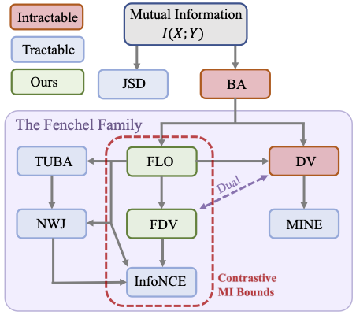
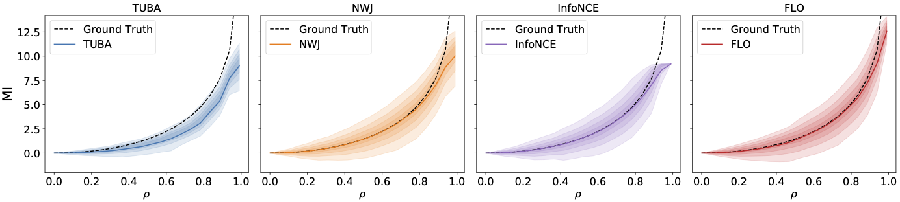
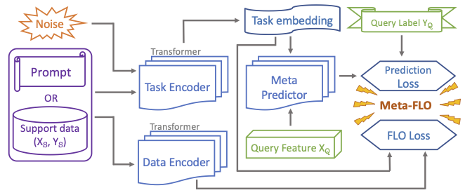

* **Mutual Information Estimation With Contrastive Fenchel-Legendre Optimization**     
  * Analyzing the limitations of the mutual information (MI) variational bound InfoNCE, with application to deep representation learning 
  * Proposing a novel unified framework for contrastive MI estimation, derived simple, powerful algorithm named Fenchel-Legendre Optimization (FLO)

 

 
    
* **Meta-Learning with Information Theoretical Objectives**                                            
  * Deriving a mutual information based meta-learning framework based on information theoretic generalization theory
  * Applying our work to the prompt tuning and few-shot learning applications

 
  
* **Association-based Optimal Subpopulation Selection for Multivariate Data**             
  * Identifying a subset of observations for which the variables are strongly associated
  * Proposing a semiparametric statistical approach for the optimal selection of subpopulations based on the patterns of associations in multivariate data
  
* **Muti-Layer Sliced Designs for Online Experimentation**                                           
  * Gauging the platform factor effects (e.g., device platforms), webpage factor effects and their interactions in online experiments for user experience and click-through-rate (CTR) improvement
  * Customized design schemes with the ordered importance of sliced factors

